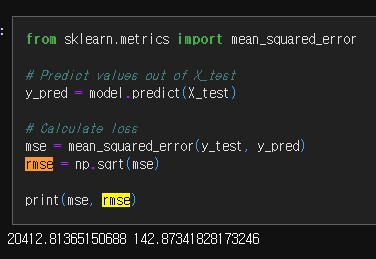
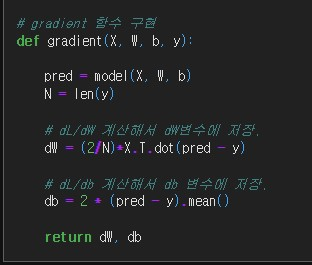
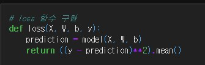

# AIFFEL Campus Online Code Peer Review Templete
- 코더 : 이현재
- 리뷰어 : 김범모

# PRT(Peer Review Template)
- [ X ]  **1. 주어진 문제를 해결하는 완성된 코드가 제출되었나요?**
    - 1프로젝트에서 MSE 3000이상을 달성해야되는데 3090으로 아쉽게 달성하지 못하였습니다..
    - 2프로젝트에서 x_train, y_train이 아니라 전체 데이터를 넣어서 학습하였습니다.
    - 2프로젝트의 rmse는 성능을 달성하였지만 전체 데이터가 학습된 상태라 오류가 있었습니다..
    - 

    
- [ O ]  **2. 전체 코드에서 가장 핵심적이거나 가장 복잡하고 이해하기 어려운 부분에 작성된 
주석 또는 doc string을 보고 해당 코드가 잘 이해되었나요?**
     - gradient 함수에 대한 개념을 자세하게 설명해주셨고 코드를 완벽하게 이해하고 있었습니다.
     - 
        
- [ O ]  **3. 에러가 난 부분을 디버깅하여 문제를 해결한 기록을 남겼거나
새로운 시도 또는 추가 실험을 수행해봤나요?**
    - 행렬의 평균을 구하는 과정에서 오류가 떴는데 해결하기 위해서 ```mean()```함수르 사용
    
        
- [ O ]  **4. 회고를 잘 작성했나요?**
    - 배운점과 느낀점이 기록되어 있지는 않지만 각 코드를 리뷰하면서 같이 설명해주셨습니다.
        
- [ O ]  **5. 코드가 간결하고 효율적인가요?**
    - 반복되는 코드를 짧게하기 위해 라이브러리 함수를 가져와서 사용하셨습니다. 그래서 코드가 간결해졌습니다.


# 회고(참고 링크 및 코드 개선)
전체적으로 코드를 작성함에 근거가 있고 명확한 이유가 있었습니다. </br>
사소한 실수만 제외하면 전체적으로 코드가 깔끔하고 이해하기 쉬운 코드였습니다.

