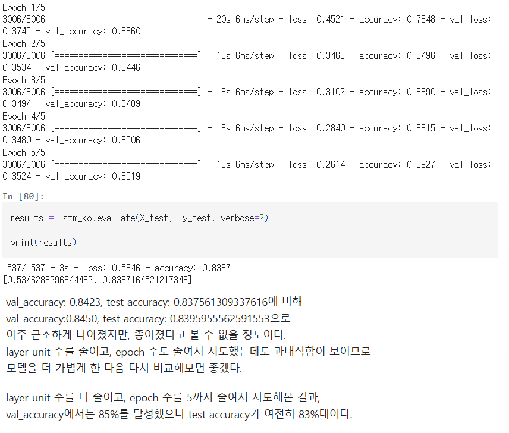
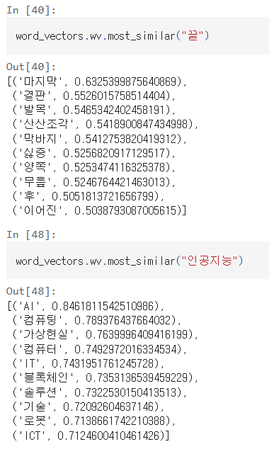
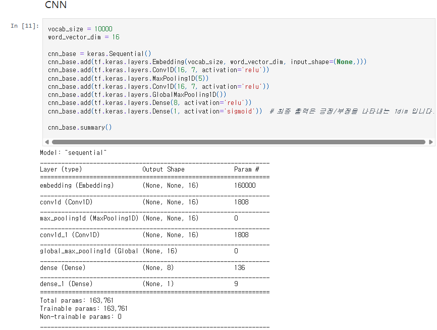
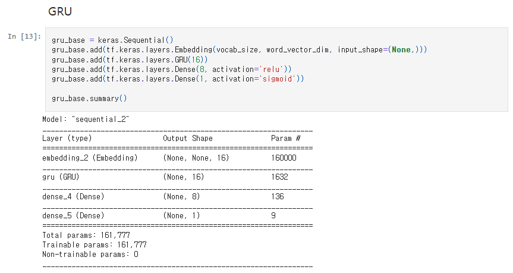
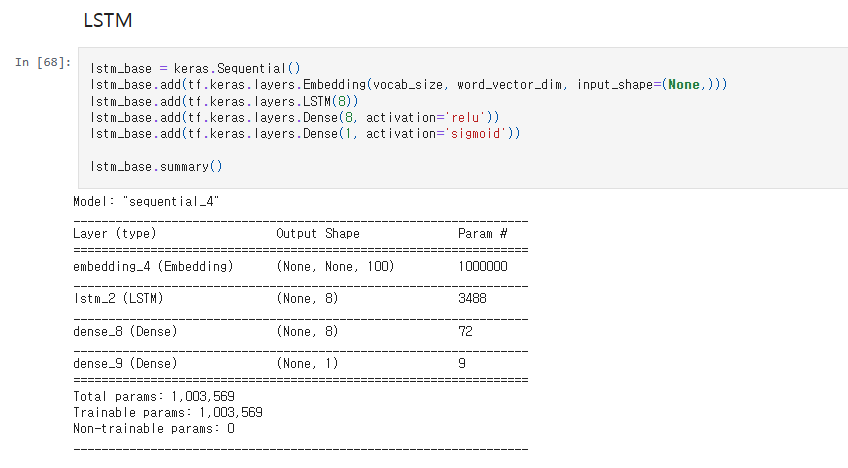
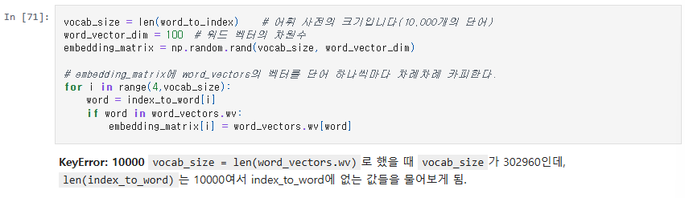
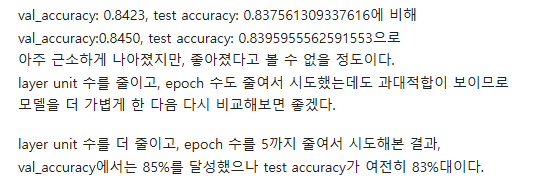
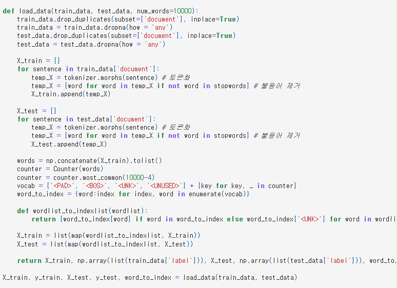

# AIFFEL Campus Online Code Peer Review Templete
- 코더 : 이현재
- 리뷰어 : 임한결


# PRT(Peer Review Template)
- [X]  **1. 주어진 문제를 해결하는 완성된 코드가 제출되었나요?**
    - 문제에서 요구하는 최종 결과물이 첨부되었는지 확인
        - 중요! 해당 조건을 만족하는 부분을 캡쳐해 근거로 첨부
    - validation accuracy는 약 85%를 달성했으나, test accuracy는 83%의 값이 나왔습니다. 
    
    - word2vec의 embedding에 단어를 넣어 유사단어를 찾는 결과가 잘 나왔습니다.
    
    - 훈련 모델들
    
    
    

- [ ]  **2. 전체 코드에서 가장 핵심적이거나 가장 복잡하고 이해하기 어려운 부분에 작성된 
주석 또는 doc string을 보고 해당 코드가 잘 이해되었나요?**
    - 해당 코드 블럭을 왜 핵심적이라고 생각하는지 확인
    - 해당 코드 블럭에 doc string/annotation이 달려 있는지 확인
    - 해당 코드의 기능, 존재 이유, 작동 원리 등을 기술했는지 확인
    - 주석을 보고 코드 이해가 잘 되었는지 확인
        - 중요! 잘 작성되었다고 생각되는 부분을 캡쳐해 근거로 첨부
    - 주석을 잘 작성하여, embedding matrix가 만들어지는 과정에 대해 잘 작성하였습니다.
    
        
- [X]  **3. 에러가 난 부분을 디버깅하여 문제를 해결한 기록을 남겼거나
새로운 시도 또는 추가 실험을 수행해봤나요?**
    - 문제 원인 및 해결 과정을 잘 기록하였는지 확인
    - 프로젝트 평가 기준에 더해 추가적으로 수행한 나만의 시도, 
    실험이 기록되어 있는지 확인
        - 중요! 잘 작성되었다고 생각되는 부분을 캡쳐해 근거로 첨부
    - 사전학습된 word2vec 모델의 embedding 차원과 훈련 모델의 embedding차원이 달라서 나온 에러를 인식하고 잘 해결하는 모습을 보여주었습니다.
    
    
        
- [X]  **4. 회고를 잘 작성했나요?**
    - 주어진 문제를 해결하는 완성된 코드 내지 프로젝트 결과물에 대해
    배운점과 아쉬운점, 느낀점 등이 기록되어 있는지 확인
    - 전체 코드 실행 플로우를 그래프로 그려서 이해를 돕고 있는지 확인
        - 중요! 잘 작성되었다고 생각되는 부분을 캡쳐해 근거로 첨부
    - 아쉬웠던 점과 더 실험해봤으면 좋았을 것 같았던 부분을 잘 인식하고 회고에 기록하였습니다.
    
    
        
- [ ]  **5. 코드가 간결하고 효율적인가요?**
    - 파이썬 스타일 가이드 (PEP8) 를 준수하였는지 확인
    - 코드 중복을 최소화하고 범용적으로 사용할 수 있도록 함수화/모듈화했는지 확인
        - 중요! 잘 작성되었다고 생각되는 부분을 캡쳐해 근거로 첨부
    - 함수화를 통해 복잡한 기능들을 잘 모듈화하고, 사용하기 쉽게 코드를 작성하였습니다.
    
    


# 회고(참고 링크 및 코드 개선)
```
# 리뷰어의 회고를 작성합니다.
# 코드 리뷰 시 참고한 링크가 있다면 링크와 간략한 설명을 첨부합니다.
# 코드 리뷰를 통해 개선한 코드가 있다면 코드와 간략한 설명을 첨부합니다.

전반적으로 코드를 잘 이해하고 모델을 훈련시키는 과정을 잘 수행하였습니다.
여러가지 타입의 모델을 각기 사용하여 어느 형태의 모델이 가장 성능이 좋았는지를 분석하는 부분도 좋았습니다.

추가적으로 개선될 수 있는 부분에 대해 작성하자면,
콜백을 사용해서 모델이 조기종료될 수 있도록 만들거나
조금 더 다양한 실험을 통해서 모델의 성능이 어떻게 변화하는지를 분석해보았으면 좋았을 것 같습니다.
```
